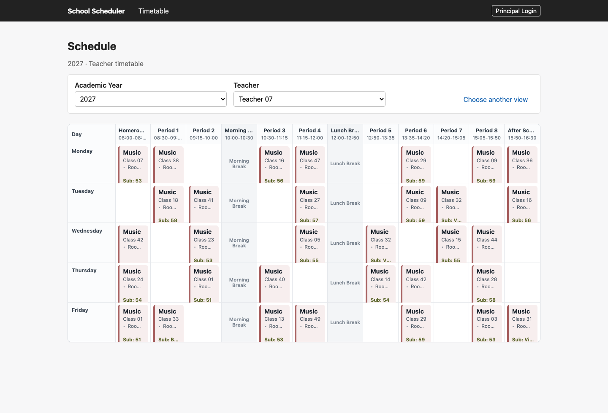

# School Scheduler

A Django application for building, validating, and presenting school timetables.

School Scheduler focuses on the operational workflow a school administrator needs: configure academic years and periods, manage teachers and teaching resources, create lessons, detect scheduling conflicts, and view the resulting timetable by teacher, student group, room, or whole school.



## Features

- Weekly timetable views for teachers, student groups, rooms, and the whole school
- Compact lesson cards with context-aware details and consistent subject colors
- Academic year and period configuration, including lesson periods and breaks
- CRUD workflows for teachers, rooms, subjects, student groups, lessons, academic years, and periods
- Conflict detection for teacher, room, and student group double-booking
- Planned substitute generation and teacher availability lookup
- Staff-only editing with public timetable viewing
- Demo data command for quickly exploring a realistic schedule

## Architecture

The project follows the simplified Clean Architecture approach described in `PROJECT_BLUEPRINT.md`.

- `app/domain`: pure Python scheduling models, policies, and domain exceptions
- `app/application`: use-case services and repository ports
- `app/infrastructure`: Django ORM models and repository implementations
- `app/presentation`: Django views, forms, renderers, templates, and navigation
- `app/management`: demo data and operational management commands
- `tests`: domain, application, infrastructure, presentation, and integration tests

Scheduling rules live in the domain and application layers. The web interface calls the application services for lesson creation and updates, so validation remains consistent across the UI and tests.

## Installation

```bash
python -m venv venv
source venv/bin/activate
pip install -r requirements.txt
```

## Demo Setup

Run the migrations, load the demo timetable, and start the development server:

```bash
python manage.py migrate
python manage.py load_demo_data
python manage.py runserver
```

Open `http://127.0.0.1:8000/`.

The demo data includes academic years, periods, rooms, subjects, student groups, teachers, and lessons so the timetable views are populated immediately.

## Testing

```bash
pytest
```

If `pytest` is not available on your shell path, run it through the active environment:

```bash
python -m pytest
```

The test suite covers scheduling behavior, validation rules, repository integration, web pages, demo data loading, and presentation renderers.

## Project Structure

```text
.
├── app/
│   ├── application/        # Use-case services and ports
│   ├── domain/             # Scheduling rules and domain objects
│   ├── infrastructure/     # Django ORM persistence
│   ├── management/         # Demo data and management commands
│   ├── presentation/       # Web UI, forms, templates, and renderers
│   └── templatetags/       # Template helpers
├── config/                 # Django project settings and URL routing
├── docs/screenshots/       # README screenshots
├── tests/                  # Unit and integration tests
├── manage.py
├── requirements.txt
└── PROJECT_BLUEPRINT.md
```

## Development Notes

- Public users can browse timetable views.
- Staff users can add and edit lessons.
- Legacy management pages remain available under `/legacy/`; Django Admin is the supported management interface for reference data.
- The scheduling algorithm, domain model, validation rules, and database schema are intentionally kept separate from presentation polish.
