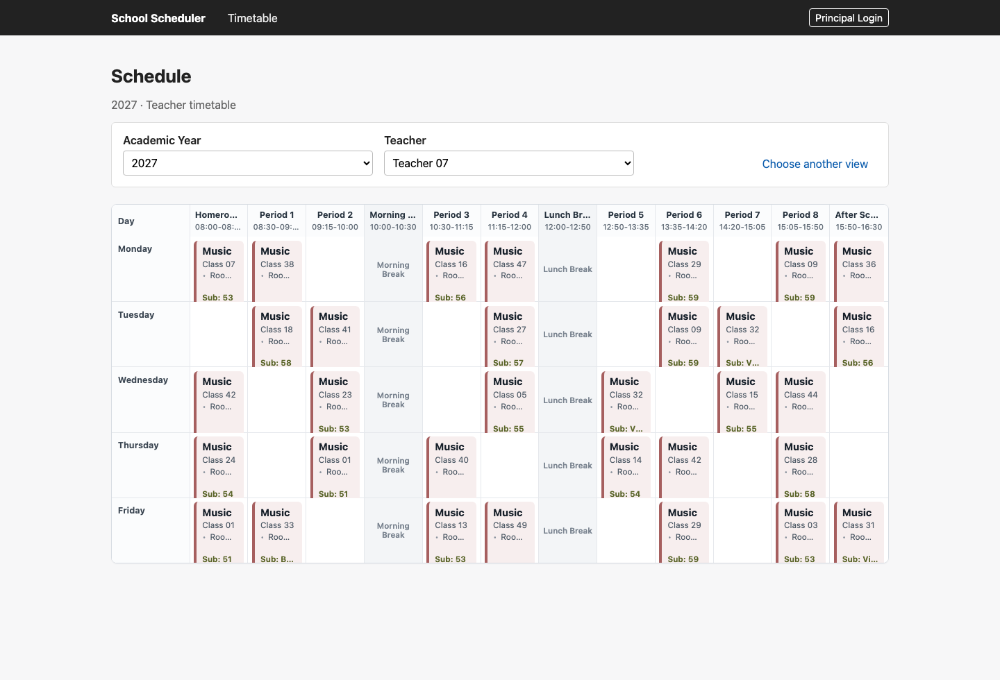

# School Scheduler

A Django application for building, validating, and presenting school timetables.

School Scheduler focuses on the operational workflow a school administrator needs: configure academic years and periods, manage teachers and teaching resources, create lessons, detect scheduling conflicts, and view the resulting timetable by teacher, student group, room, or whole school.



## Features

- Weekly timetable views for teachers, student groups, rooms, and the whole school
- Compact lesson cards with context-aware details and consistent subject colors
- Academic year and period configuration, including lesson periods and breaks
- CRUD workflows for teachers, rooms, subjects, student groups, lessons, academic years, and periods
- Conflict detection for teacher, room, and student group double-booking
- Planned substitute generation and teacher availability lookup
- Staff-only editing with public timetable viewing
- Demo data command for quickly exploring a realistic schedule

## Architecture

The project follows the simplified Clean Architecture approach described in `PROJECT_BLUEPRINT.md`.

- `app/domain`: pure Python scheduling models, policies, and domain exceptions
- `app/application`: use-case services and repository ports
- `app/infrastructure`: Django ORM models and repository implementations
- `app/presentation`: Django views, forms, renderers, templates, and navigation
- `app/management`: demo data and operational management commands
- `tests`: domain, application, infrastructure, presentation, and integration tests

Scheduling rules live in the domain and application layers. The web interface calls the application services for lesson creation and updates, so validation remains consistent across the UI and tests.

## Installation

```bash
python -m venv venv
source venv/bin/activate
pip install -r requirements.txt
```

## Database

**PostgreSQL is the project's standard database backend, for local development, testing, and production alike — there is no SQLite fallback.** Connection settings always come from environment variables (never hardcoded), so the same `config/settings.py` works unchanged everywhere; only the environment differs.

### Local PostgreSQL setup (macOS)

Install and start PostgreSQL via Homebrew if you don't already have it running:

```bash
brew install postgresql@16
brew services start postgresql@16
```

Create a dedicated role and database for this project (`createuser`/`createdb` also work; this uses `psql` directly so the role gets `CREATEDB`, which the test suite needs to create and tear down its own isolated test database):

```bash
export PATH="/opt/homebrew/opt/postgresql@16/bin:$PATH"
psql postgres -c "CREATE ROLE school_scheduler WITH LOGIN PASSWORD 'choose-a-local-password' CREATEDB;"
psql postgres -c "CREATE DATABASE school_scheduler_dev OWNER school_scheduler;"
```

### Required environment variables

Copy `.env.example` to `.env` and fill in the password you chose above:

```bash
cp .env.example .env
```

| Variable | Required | Default | Purpose |
|---|---|---|---|
| `DB_NAME` | yes | — | Database name (e.g. `school_scheduler_dev`) |
| `DB_USER` | yes | — | Role name (e.g. `school_scheduler`) |
| `DB_PASSWORD` | yes | — | Role password |
| `DB_HOST` | no | `localhost` | Database host |
| `DB_PORT` | no | `5432` | Database port |

`.env` is gitignored and loaded automatically (via `python-dotenv`) when Django starts — nothing elsewhere in the codebase reads these variables directly; they're only ever used to build `DATABASES` in `config/settings.py`. If a required variable is missing, Django raises a clear `ImproperlyConfigured` error naming exactly which one, rather than silently falling back to any default database.

A real deployment sets these same variables directly in its own environment (never via a committed `.env`) and should point at its own separate database/instance — development and production must never share one.

### Migrations, tests, and demo data

```bash
python manage.py migrate
python manage.py load_demo_data   # optional — populates two demo schools
python manage.py runserver
```

Open `http://127.0.0.1:8000/`.

```bash
python -m pytest
```

Each test run uses its own isolated `test_<DB_NAME>` database, automatically created and destroyed by `pytest-django`/Django — your real `DB_NAME` database (and any demo data in it) is never touched by the test suite. This is why the role needs `CREATEDB`.

### Backing up and restoring

Back up with Postgres's own dump tool (adjust `DB_NAME` to match your `.env`):

```bash
pg_dump -h localhost -U school_scheduler school_scheduler_dev > backups/school_scheduler_dev.sql
```

Restore from such a dump into a fresh database:

```bash
createdb -h localhost -U school_scheduler school_scheduler_dev_restored
psql -h localhost -U school_scheduler school_scheduler_dev_restored < backups/school_scheduler_dev.sql
```

`backups/` is gitignored — dumps may contain password hashes and must never be committed.

If you need to fall back to the pre-PostgreSQL SQLite workflow temporarily (e.g. to compare behavior), the previous `DATABASES` block pointing at `db.sqlite3` is in git history on the commit before the PostgreSQL migration; `db.sqlite3` itself is untouched and still present if it exists in your checkout.

## Production Configuration

Local development and production share the same `config/settings.py` — only the environment variables differ. `DJANGO_ENV` is the one explicit switch between them; every other setting below is still individually overridable via its own variable regardless of `DJANGO_ENV`.

```bash
# Unset, or:
DJANGO_ENV=development   # default
DJANGO_ENV=production
```

### Mandatory in production, with no fallback

| Variable | Why |
|---|---|
| `SECRET_KEY` | Signs sessions and CSRF tokens. There is **no hardcoded production fallback** — if `DJANGO_ENV=production` and `SECRET_KEY` is unset, Django refuses to start with a clear `ImproperlyConfigured` error rather than running insecurely. Generate one with: `python -c "from django.core.management.utils import get_random_secret_key; print(get_random_secret_key())"` |
| `ALLOWED_HOSTS` | Comma-separated hostnames (e.g. `example.com,www.example.com`). Required when `DJANGO_ENV=production` — with none set, Django would reject every request outright. Not required in development, where it defaults to `localhost,127.0.0.1`. |

In development, `SECRET_KEY` defaults to an obviously-insecure placeholder (`django-insecure-...`, matching Django's own convention for generated dev keys) purely so a fresh checkout works without first generating one — this default is **never** used when `DJANGO_ENV=production`.

### Optional, with environment-aware defaults

These default to Django's production-safe value only when `DJANGO_ENV=production`, and to a value that keeps plain `http://localhost:8000` development working otherwise. Override any of them individually if needed:

| Variable | Dev default | Prod default |
|---|---|---|
| `DEBUG` | `true` | `false` |
| `SECURE_SSL_REDIRECT` | `false` | `true` |
| `SESSION_COOKIE_SECURE` | `false` | `true` |
| `CSRF_COOKIE_SECURE` | `false` | `true` |
| `SECURE_HSTS_SECONDS` | `0` | `3600` (1 hour) |

Booleans accept `true`/`false`, `yes`/`no`, `on`/`off`, or `1`/`0` (case-insensitive) — never pass something else; an unrecognized value fails loudly rather than being guessed at.

`SECURE_HSTS_SECONDS` defaults to a conservative **1 hour** in production, not the eventually-recommended 1 year — HSTS tells browsers to refuse plain `http://` for however long you set, which is awkward to undo if anything is misconfigured. Raise it gradually (e.g. `86400`, then `604800`, then `31536000`) only after confirming HTTPS works correctly site-wide. `SECURE_HSTS_INCLUDE_SUBDOMAINS` and `SECURE_HSTS_PRELOAD` are **never** enabled by default — both are a larger, harder-to-reverse commitment than this project needs yet; `manage.py check --deploy` will keep warning about both until you decide otherwise and set them deliberately in `config/settings.py`.

### Optional, situational

| Variable | When you need it |
|---|---|
| `CSRF_TRUSTED_ORIGINS` | Only once a real HTTPS domain exists (comma-separated, e.g. `https://example.com`). Not needed for a same-origin, non-proxied setup. No placeholder domain is hardcoded — it's empty until you set it. |
| `BEHIND_TLS_PROXY` | Set to `true` **only if** this deployment actually sits behind a reverse proxy/load balancer that terminates TLS and sets `X-Forwarded-Proto` (common on PaaS hosts). This enables `SECURE_PROXY_SSL_HEADER`. Enabling it when there is no such proxy lets a client spoof that header and defeat `SECURE_SSL_REDIRECT` — leave it unset unless you've confirmed the proxy is there. |

### Static files

```bash
python manage.py collectstatic --noinput
```

Collects into `staticfiles/` (gitignored — regenerated on each deploy, never committed). This application's own pages have no static assets of their own (all styling is inline in templates) — only Django Admin's built-in CSS/JS need collecting.

**`collectstatic` does not make these files reachable over HTTP by itself.** A production deployment still needs a web server or a static-file-serving solution (e.g. nginx in front of the app, or a package like `whitenoise`) configured to actually serve `STATIC_ROOT` at `STATIC_URL` — this has not been added yet, since the project has no deployment target chosen.

### Logging

Errors always go to stderr (via a plain `StreamHandler`, no file handling, no email, no extra dependency) — this is what a containerized or platform-based deployment (Docker, most PaaS hosts) captures as log output automatically. Unlike Django's own default logging config, this logs regardless of `DEBUG`, so production errors are never silent. Nothing here logs request bodies, so passwords and session contents are never written to the log.

### Deployment checks

```bash
DJANGO_ENV=production SECRET_KEY=... ALLOWED_HOSTS=your-domain.com python manage.py check --deploy
```

Run this with your real intended production values before deploying. As of this configuration, only `security.W005` (HSTS subdomains) and `security.W021` (HSTS preload) remain by design — see above for why.

### Before deploying, you must still supply

- A real `SECRET_KEY` (generated, not reused from any example)
- Your real production domain(s) in `ALLOWED_HOSTS`
- `CSRF_TRUSTED_ORIGINS` once that domain serves over HTTPS
- `DB_*` pointing at a **separate production database** — never the same instance as local development, and never seeded by restoring a dump of the local dev database (see the security note below)
- `BEHIND_TLS_PROXY=true` if and only if the chosen host puts a TLS-terminating proxy in front of the app
- A static-file-serving solution for `STATIC_ROOT` (not yet chosen — see above)
- A WSGI server (e.g. gunicorn) in front of `config.wsgi.application` — not yet added, since no hosting provider has been chosen (deployment infrastructure itself is a later phase)

### Security note: never seed production from a local dev dump

The local development database has accumulated more than demo data over time — notably one leftover Django superuser account unrelated to the two intended demo principals (see `PROJECT_ROADMAP.md`'s Phase 11 session log for detail). Initialize a real production database with `python manage.py migrate` (and, if a staged demo is wanted, `load_demo_data`) — never by restoring a `pg_dump` of the local development database, which would carry that account's full, unscoped Django Admin access into production.

## Project Structure

```text
.
├── app/
│   ├── application/        # Use-case services and ports
│   ├── domain/             # Scheduling rules and domain objects
│   ├── infrastructure/     # Django ORM persistence
│   ├── management/         # Demo data and management commands
│   ├── presentation/       # Web UI, forms, templates, and renderers
│   └── templatetags/       # Template helpers
├── config/                 # Django project settings and URL routing
├── docs/screenshots/       # README screenshots
├── tests/                  # Unit and integration tests
├── manage.py
├── requirements.txt
└── PROJECT_BLUEPRINT.md
```

## Development Notes

- Public users can browse timetable views.
- Staff users can add and edit lessons.
- Legacy management pages remain available under `/legacy/`; Django Admin is the supported management interface for reference data.
- The scheduling algorithm, domain model, validation rules, and database schema are intentionally kept separate from presentation polish.
